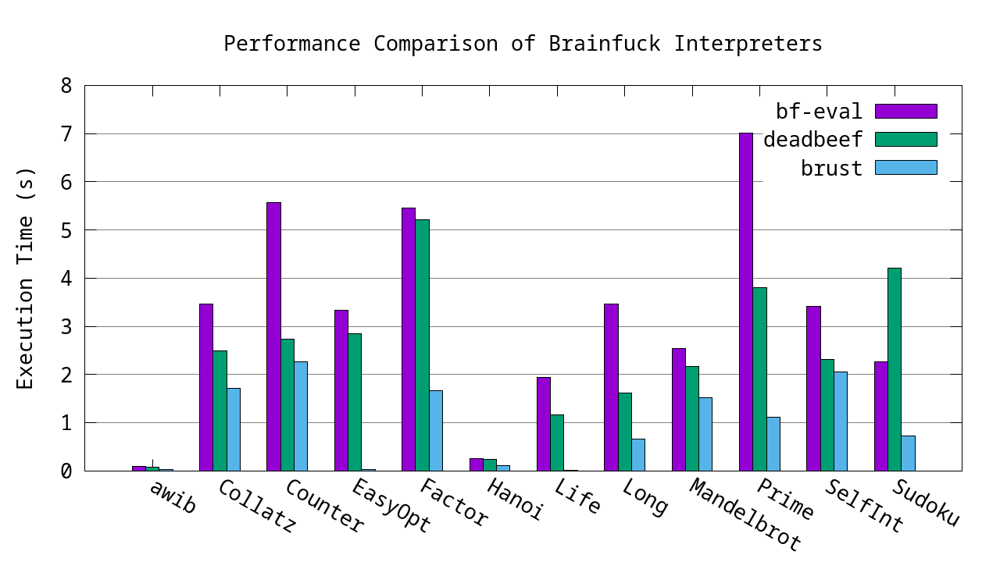

# BRUST
A fast Brainfuck interpreter by 

## Build
```shellsession
$ git clone https://github.com/void-hoge/brust.git
$ cd brust
$ cargo build --release
```

## Usage
```shellsession
$ brust -h
Brainfuck interpreter

Usage: brust [OPTIONS] <FILE>

Arguments:
  <FILE>  

Options:
  -l, --length <LENGTH>  [default: 65536]
  -f, --flush            
  -h, --help             Print help
$
```

## Performance



- `bf-eval`: Optimized interpreter in Go by Uchijo
  - https://github.com/Uchijo/bf-eval
- `deadbeef`: Simple but fast interpreter in C by Robert de Bath

## Author
- Mugi Noda (void-hoge)

## License
- GPLv3
